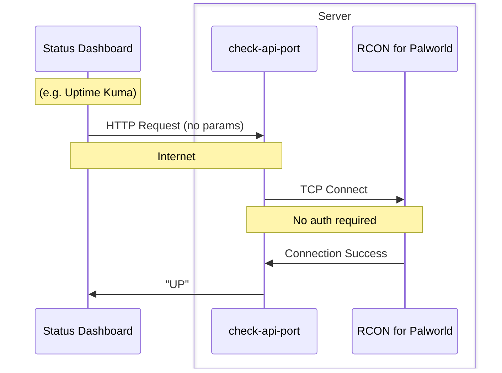

# check-port-api

This is a simpler health checker that acts as a proxy to check ports not exposed. 

The API responds with either `UP` or `DOWN` if a TCP Connection is made to the target. 

For example, I'm using this with a Palworld server like below. The goal being never to expose access to RCON to the internet.



# Help

```bash
Host a really simple API that responds UP or DOWN if it finds a specific address+port is listenin.
This is useful to act as a proxy to check if a certain port is open on a system but its not actually exposed.

Usage:
  check-port-api [flags]

Flags:
      --check-host string    The hostname to check
      --check-port string    The port to check
  -h, --help                 help for check-port-api
      --listen-host string   The hostname to listen on (default "0.0.0.0")
      --listen-port string   The port to listen on (default "8181")
      --timeout duration     Timeout to check target (default 5s)
```

# Docker

There is a docker container available: `docker.io/bostrt/check-api-port:latest`. Here is a very simple docker compose file for reference:

- Note the exposed port `8181` on `check-port-api` container.
- Note the usage of the docker compose service name `palworld` as host to check
- Note the RCON port `25575` is used but also is not exposed outside of the container network
- Lastly, note that the `check-port-api` container requires no knowledge of RCON credentials since only a TCP connect is performed

```yaml
services:
  check-port-api:
    image: docker.io/bostrt/check-port-api:dev
    pull_policy: always
    restart: unless-stopped
    container_name: check-port-api
    ports:
      - 8181:8181/tcp
    depends_on:
      - palworld
    command:
      - --check-host=palworld
      - --check-port=25575
  palworld:
      image: thijsvanloef/palworld-server-docker:latest
      pull_policy: always
      restart: unless-stopped
      container_name: palworld-server
      ports:
        - 8212:8212/udp
        - 27016:27016/udp
      environment:
         - PUID=1000
         - PGID=1000
         - PORT=8212
         - QUERY_PORT=27016
         - PLAYERS=8
         - MULTITHREADING=true
         - RCON_ENABLED=true
         - RCON_PORT=25575
      volumes:
         - ./palworld:/palworld/:z
```